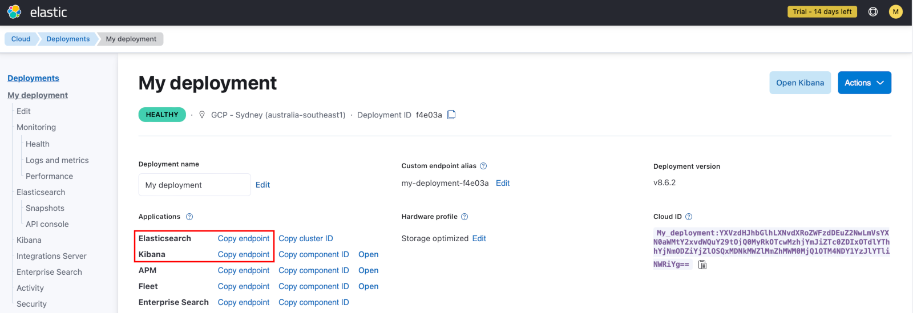

# Data Pipeline Workshop

This workshop will provide good exposure to the tools and processes needed to create a complete data stream from source to target. The stream you will create is a simulation of a stock trade data stream.
We will use Astra Streaming topics/functions/sinks, the Pulsar CLI, file data sources, Astra DB with CDC, and finally ElasticSearch.

The process you will follow for this workshop is as follows:
    
* Incoming data will come from a file that will be consumed by a Pulsar source (running locally on your laptop or on GitPod).  This will provide experience in using the Pulsar CLI to interact with Astra.  
* We will deploy a function that will enrich the messages, and store them in Astra DB using a sink.
* CDC will detect changes in the Astra DB table and publish them to a data topic in Astra Streaming.
* We will deploy a function that filters messages and publishes them to multiple topics based on their content.
* Messages from those topics will be consumed with sinks to ElasticSearch.

## Prerequisites
To execute this workshop, ensure that you have the following:
* Java 11 installed
* [Pulsar 2.10.x](https://github.com/datastax/pulsar/releases/download/ls210_4.0/lunastreaming-2.10.4.0-bin.tar.gz)
* An [Astra](https://astra.datastax.com) account
* An [ElasticSearch](https://www.elastic.co/) account

### DataStax Astra
If you do not have an Astra account, create a free trial account at [Astra Registration](https://astra.datastax.com/register).


### ElasticSearch
If you do not have an ElastSearch account, create a free trial account and then:

* create a deployment in the uscentral1 GCP region.  <b>Be sure to save the credentials that are provided</b> as you'll need them later.
* click on your deployment in the menu on the left.
* Take note of the following items as you'll need them in later steps:
    * ElasticSearch endpoint
    * Kibana endpoint



## Setup
In this section, we will walk through setup of the tools needed to execute this workshop.  This includes the Pulsar CLI, our Astra DB table, and ElasticSearch.

### Pulsar CLI tools
1. Download the [Pulsar 2.10.x](https://github.com/datastax/pulsar/releases/download/ls210_4.0/lunastreaming-2.10.4.0-bin.tar.gz) archive. 
2. Extract the archive.
    ```sh
    tar zxf lunastreaming-2.10.4.0-bin.tar.gz
    ```
3. Make a note of this directory location as `<YOUR PULSAR DIR>`
4. Create the connectors directory:
    ```sh
    cd lunastreaming-2.10.4.0
    mkdir connectors
    ```

### Astra Streaming Tenant and Namespace
1. Log into your Astra account.

2. Create a Streaming Tenant
    - Navigate to *Streaming* in the Menu.
    - Click on the *Create Tenant* button.
    - Create a streaming tenant using the following:
        * Tenant Name: irt
        * Provider: Google Cloud
        * Region: useast1
    
    

3. Create a Namespace & Topic
    1. Create Namespace 
        - Navigate to *Streaming* in the Menu.
        - Open the `irt` tenant.
        - Navigate to the *Namespace and Topics* tab.
        - Click on the *Create Namespace* button.
        - Enter `stocks` as the Namespace Name.
    2. Create Topic
        - Click on the *Add Topic* button in the `stocks` Namespace.
        - Enter `stocks-in` as the Topic Name.

        
    3. Create Schema
        - Open the `stocks-in` Topic.
        - Navigate to the *Schema* tab.
        - Click on the *Create Schema* button.
        - Select `String` as the Schema Type.

        

4. Add Streaming Configuration to Pulsar CLI
    1. Download configuration file
        - Navigate to the *Connect* tab.
        - Click on the *Download client.conf* button.
    2. Add *client.conf* to Pulsar CLI
        - Navigate to `<YOUR PULSAR DIR>/conf` on your laptop.
            ```sh
            cd <YOUR PULSAR DIR>/conf
            ```
        - Move the existing `client.conf` file to `client.conf.local` and copy the file you just downloaded into this directory with the name `client.conf`.  
            ```sh
            mv client.conf client.conf.local
            cp <PATH TO NEW FILE>/client.conf .
            ```

## Creating the Pulsar Stream

### Pulsar from the Command Line

The various Pulsar CLIs are installed as part of the Pulsar distribution and can be found the `<YOUR PULSAR DIR>/bin` directory.

1. Change directory into the bin directory.
    ```sh
        cd <YOUR PULSAR DIR>/bin
    ```

2. Create a **consumer** using the following command.  The `-s` option specifies your subscription name and the `-n 0` option tells the client to consume messages continuously.
    ```sh
        ./pulsar-client consume -s test -n 0 irt/stocks/stocks-in`
    ```

3. In a new terminal window, create a **producer** using the following command.
    ```sh
        ./pulsar-client produce -m hello irt/stocks/stocks-in
    ```
     
You should see the message content `key:[null], properties:[], content:hello` as the output in the consumer's console.  At this point you have your first topic created and you have verified that you can connect to Astra Streaming and produce/consume messages.
    
### File Source

Now that you have a topic that you can publish to, create a Pulsar file source connector running locally on your laptop and let it process an input file. You will specify a folder in which the connector will look for files.  

1. Create a directory `/tmp/stocks`
    ```sh
        mkdir /tmp/stocks
    ```

2. Install the File Connector
    1. Download the [file connector](https://www.apache.org/dyn/mirrors/mirrors.cgi?action=download&filename=pulsar/pulsar-2.10.3/connectors/pulsar-io-file-2.10.3.nar) from the Apache Pulsar site.
    2. Place this file in `<YOUR PULSAR DIR>/connectors`.

3. Collect the following information:
    * \<TOKEN\>: **authParams** in your `client.conf` file.
    * \<BROKER SERVICE URL\>: **brokerServiceUrl** in your `client.conf` file.
    * \<YOUR GITHUB PROJECT DIR\>: The location of the GitHub project folder.


4. Start the File Connector

    (The directory locations need to be the fully qualified directory and not the relative path.)
    ```sh
    ./pulsar-admin sources localrun \
        --broker-service-url <BROKER SERVICE URL> \
        --client-auth-plugin org.apache.pulsar.client.impl.auth.AuthenticationToken \
        --client-auth-params "<TOKEN>" \
        --archive <YOUR PULSAR DIR>/connectors/pulsar-io-file-2.10.3.nar \
        --name stocks-file-source \
        --destination-topic-name irt/stocks/stocks-in \
        --source-config-file <YOUR GITHUB PROJECT DIR>/stock-price-file-connector.yaml
    ```

5. Trigger a file read
    1. Start the same consumer from the previous step (if it's not still running)
    2. Place Data File
        ```sh
        cp <YOUR GITHUB PROJECT DIR>/stock-prices-10.csv /tmp/stocks
        ```

    You should see the log for the file source display processing statements, and you should see new messages output by the consumer.  There will be a message for each line in the file.


### Enrichment Function

Next we will add a function to the stream.  This function will consume messages from the `stocks-in` topic, convert the message to a Java object, add a GUID, and then publish a message as a JSON schema.  You can find the function code in `<YOUR GITHUB PROJECT DIR>src/main/java/com/datastax/demo/function/AddUuidToStockFunction.java` in the GitHub repo you cloned.  

1. Create a topic called `stocks-enriched` in your stocks namespace.

2. Compile the function
    ```sh
    cd <YOUR GITHUB PROJECT DIR>
    ./mvnw clean install
    ```
    This will create a jar file in the `<YOUR GITHUB PROJECT>/target`

3. Create an Astra Streaming Function
    1. Navigate to the `Functions` tab of the `irt` streaming tenant.
    2. Click on the *Create Function* button.
    3. Create the function using:
        - Name Your Function
            - Function Name: `enrichFunction`
            - Namespace: `stocks`
        - Upload Your Code
            - Upload my own code
            - Select the file `function-demo-0.0.1-SNAPSHOT.jar`
            - Choose a function: `AddUuidToStockFunction`
        - Choose Input Topics
            - Namespace: `stocks`
            - Input Topic: `stocks-in`
        - Choose Destination Topics
            - Namespace: `stocks`
            - Input Topic: `stocks-enriched`
        - Leave the advanced configuration items set to the defaults.
    4. You can watch the startup of your function by clicking the name and scrolling to the bottom where the logs are displayed.

4. Create a **consumer** for `stocks-enriched`
    1. In a new terminal window:
    ```sh
    cd <YOUR PULSAR DIR>
    ./pulsar-client consume -s test -n 0 irt/stocks/stocks-enriched
    ```
5. Trigger a file read
    1. Place Data File
        ```sh
        cp <YOUR GITHUB PROJECT DIR>/stock-prices-10.csv /tmp/stocks
        ```

You should see messages consumed by the Pulsar client we just created.  They should be in JSON format.


### Storing Data in Astra DB

The messages that are created by consuming the stock file and enriched by the first function will be inserted into a table in Astra DB. 

1. In the Astra DB UI, create a database called as-demo in the uscentral1 GCP region with a keyspace named demo.  **Be sure to download your token details.** You'll need them to create the Astra DB sink.

2. Once the database is created, create the following table:
    ```
    create table demo.stocks ( 
        uid uuid primary key,
        symbol text, 
        trade_date text, 
        open_price float, 
        high_price float, 
        low_price float, 
        close_price float, 
        volume int 
    );
    ```
    DO NOT enable CDC on this table yet.

3. To create an Astra DB sink, go to the your Astra Streaming tenant and click on the Sinks tab. Once there click Create and fill in the form with the information based on what we've done to this point. You'll consume the `stocks-enriched` topic and you'll need to use the following mapping. Do not use the default mapping if the field is populated:

```
uid=value.uuid,symbol=value.symbol,trade_date=value.date,open_price=value.openPrice,high_price=value.highPrice,low_price=value.lowPrice,close_price=value.closePrice,volume=value.volume
```

    For the token, you'll use the token value found in the credentials file you just downloaded when creating your Astra DB instance. Use the defaults for everything else.

4. Copy the `<YOUR GITHUB PROJECT DIR>/stock-prices-10.csv` file to the `/tmp/stocks` directory. You should see 10 records inserted into the table once it completes.

### Change Data Capture 

Now that we have a table, let's enable CDC and look at what gets created.

1. Click on the CDC tab in your Astra DB instance.  Click the `Enable CDC` button at the top right and then pick your tenant, keyspace, and enter the table name.  The table should be enabled quickly.  

2. Return to your streaming tenant and click on the `Namespaces and Topics` tab.  You should now see an `astracdc` namespace.  If you open that namespace you should see a data topic and a log topic.

3. Create a consumer from the CLI that consumes the data topic and copy your data file to the temp directory again.  Your consumer should receive 10 messages. 

### Stock Filter Function
The last part of the stream prior to sending data to external systems is to create the filter function in Astra Streaming.  This function will consume data from the CDC data topic and publish a new message to the topic that corresponds to the symbol in the message.

1. Create three topics from the command line using the "pulsar-admin".  Give this a try using the CLI if you want to get experience creating things from that point of view.

    * stocks-aapl
    * stocks-goog
    * stocks-default

    Look at the filter function code in your GitHub project.  This code provides an example of how you can publish messages to multiple topics from one function.  It works by looking at the stock symbol field of the incoming message and filters based on the value.  It will pass all messages that match AAPL to the "stocks-aapl" topic and all messages that match "GOOG" to the "stocks-goog" topic.  All messages will be published to the `stocks-default` topic.

2. Edit `FilterStockByTicker.java` changing the tenant name to your tenant.
3. Compile the class with `./mvnw clean package`
4. Deploy the function to Astra Streaming using the CDC data topic as the input and `stocks-default` as the destionation topic.
5. Create a consumer for each of the output topics, and then copy your data file to your temp directory to verify everything works.

### Send Data to External Targets
#### ElasticSearch Sink
The ElasticSearch sink is a built in connector for Astra Streaming.  Once you have an ElasticSearch account created, you'll need the following values in order to create the sink.

* Elastic URL which you can get from your deployment configuration in the Elastic dashboard
* The username/password from the credentials file you downloaded when creating your deployment

1. With those values available, click on the Sinks tab within your Astra Streaming tenant.  Pick your `stocks` namespace, add a name for your sink, choose Elastic Search as the sink type.  Once the sink type is chosen, the configuation items needed will be displayed below.  Fill in those fields with the following values.

    * Elastic URL
    * Use the `stocks` namespace
    * Use the `stocks-aapl` topic as the input
    * Use the username/password from the credentials file
        * You can skip the token and API key fields
    * Disable `Ignore Record Key`
    * Disable `Strip Nulls`
    * Disable `Enable Schemas`
    * Enable `Copy Key Fields`

    For all other values, you can leave them set to the defaults and click the `Create` button.  Click the sink name on the following page and you can see the configuration and logs for the sink as it's being created.

2. Once the sink is running, copy the stocks data file to `/tmp/stocks`.  If you still have your function and command line consumers running you should see messages flow through the various topics.

3. Now that the data has been moved, go to the home page in your Kibana deployment, and click on `Enterprise Search`.  On the next page, click `Indices` and you should see an index called `appl-index`.  Click it and then the `Documents` tab, and you'll see records that were sent through the AAPL topic by the filter function created in the previous step.

You can follow the same steps to create a sink for the `stocks-goog` topic if you want to try out creating multiple sinks.
